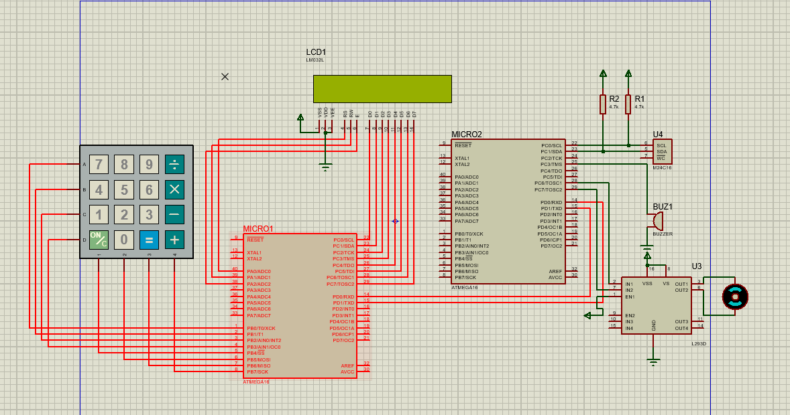
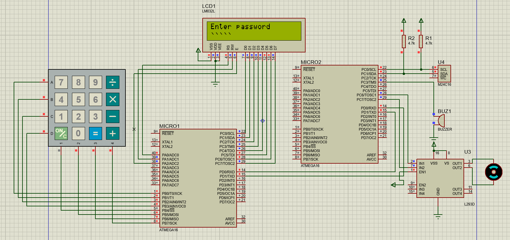
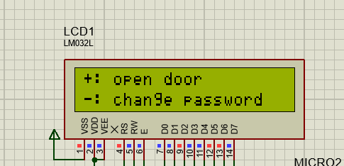
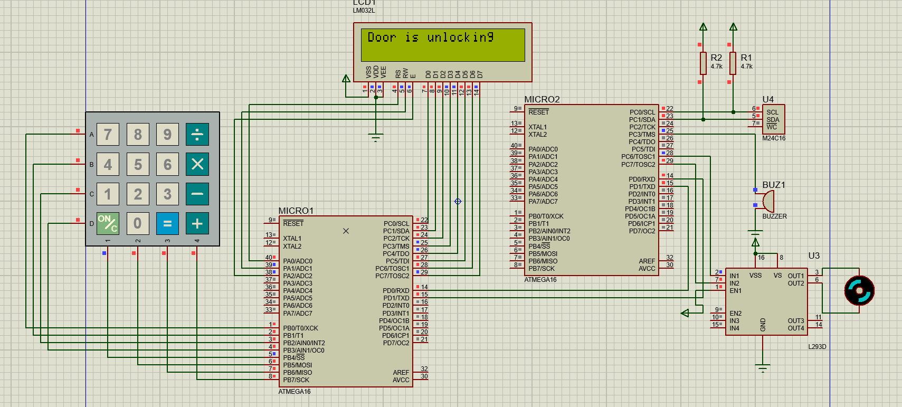
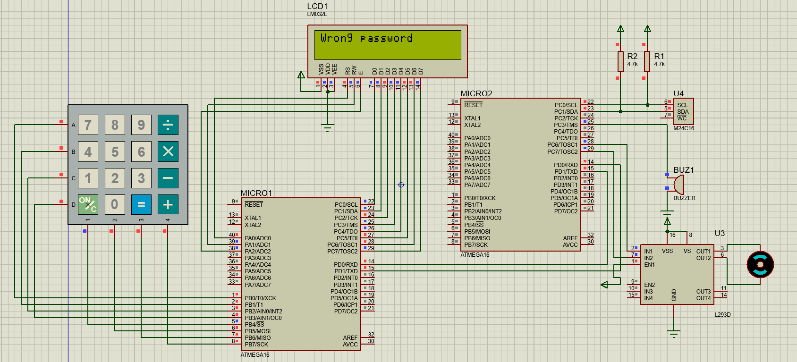
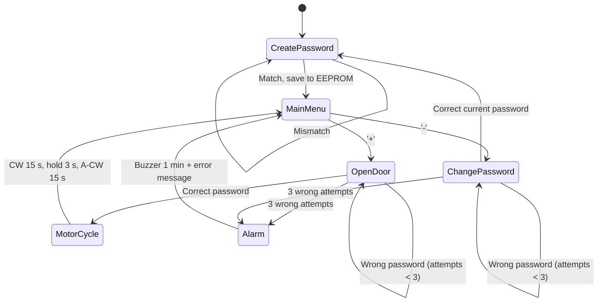

# 🔐 Door Locker Security System

**Dual-MCU password-protected door lock · C · ATmega16 · UART · I2C**

A door-lock system built on two ATmega16 microcontrollers running at **8 MHz** and communicating over **UART**. One MCU handles the keypad and LCD (the user interface). The second controls the lock actuator (DC motor), the buzzer, and password storage in an external **I2C EEPROM**. Splitting the work this way keeps responsibilities separate and contains faults: the HMI only collects input and shows results, while every security decision is made on the Control ECU.

---

## 📸 Simulation Preview

> Simulated in Proteus. Replace the image paths below with your own screenshots (see [Adding screenshots](#-adding-screenshots)).

| Full circuit | Create password |
|:---:|:---:|
|  |  |

| Main menu | Door opening (motor CW) |
|:---:|:---:|
|  |  |

| Wrong password ×3 (buzzer + error) |
|:---:|
|  |

---

## ✨ Features

- **First-time password setup** with confirmation: the user enters a 5-character password, then re-enters it. It is saved only if both entries match; otherwise the setup repeats.
- **Persistent storage:** the password is saved in an external EEPROM over **I2C**, so it survives power loss.
- **Main menu** on a 2×16 LCD:
  - `+` : Open door
  - `-` : Change password
- **Open door:** on a correct password, the DC motor runs the full unlock cycle:
  1. Rotate **clockwise** for **15 s** (door unlocking)
  2. **Hold** for **3 s** (door open)
  3. Rotate **anticlockwise** for **15 s** (door locking)
- **Security lockout:** after **3 consecutive wrong passwords**, the buzzer sounds for **1 minute**, an error message is shown on the LCD, and the system returns to the main menu.
- **Timer-based timing** on both MCUs (motor sequence and buzzer duration).
- **Password masking:** typed characters appear as `*` on the LCD.
- **Separation of concerns:** the HMI never stores or verifies the password. The Control ECU owns all decisions.

---

## 🧭 System Architecture

| ECU | Role | Peripherals |
|---|---|---|
| **HMI ECU** (MC1) | User interface. Reads keys, shows messages, forwards input. | 4×4 keypad, 2×16 LCD, UART, Timer |
| **Control ECU** (MC2) | Verifies passwords and drives the hardware. | I2C (external EEPROM), UART, Timer, buzzer, DC motor |

```
┌───────────────────────┐        UART        ┌───────────────────────────┐
│   HMI ECU  (MC1)      │  ◄──────────────►  │   Control ECU  (MC2)      │
│   ATmega16 @ 8 MHz    │                    │   ATmega16 @ 8 MHz        │
│                       │                    │                           │
│   • Keypad 4×4        │                    │   • I2C ──► EEPROM        │
│   • LCD 2×16          │                    │   • Buzzer                │
│   • UART, Timer       │                    │   • DC Motor              │
│                       │                    │   • UART, Timer           │
└───────────────────────┘                    └───────────────────────────┘
```

### Why two MCUs?

- **Fault containment:** if the HMI hangs or misbehaves, the Control ECU still enforces the security rules.
- **Security:** the password lives only on the Control ECU side. The HMI just forwards what the user types.
- **Clean design:** each MCU has one clear job, so the code is easier to test and maintain.

---

## ⚙️ Operating Flow

### Step 1: Create the password
1. LCD shows `Please enter Pass:`. The user types 5 characters (shown as `*****`) and presses enter.
2. LCD shows `Please re-enter same Pass:`. The user types it again and presses enter.
3. **Match:** the password is saved in EEPROM, then the system goes to Step 2.
4. **Mismatch:** Step 1 repeats.

### Step 2: Main menu
- `+` : Open door
- `-` : Change password

### Step 3: Open door (`+`)
1. LCD shows `Please enter Pass:`. The user types the password and presses enter.
2. **Match:** the motor rotates **CW for 15 s**, **holds for 3 s**, then rotates **A-CW for 15 s**.
3. **Mismatch:** the user is asked again. After **3 consecutive mismatches**, the buzzer runs for **1 minute**, an error message is shown, and the system returns to Step 2.

### Step 4: Change password (`-`)
The user enters the current password and, if correct, sets a new password with the same enter-and-confirm process as Step 1. A wrong current password follows the same 3-strikes rule as Step 3.

### State diagram



---

## 🧱 Hardware

| Component | Qty | Notes |
|---|---|---|
| ATmega16 microcontroller | 2 | 8 MHz clock each |
| 4×4 keypad | 1 | On the HMI ECU |
| 2×16 character LCD | 1 | On the HMI ECU |
| External EEPROM (I2C) | 1 | Password storage, on the Control ECU |
| DC motor + driver | 1 | Lock actuator, on the Control ECU |
| Buzzer | 1 | Alarm, on the Control ECU |

---

## 🗂️ Project Structure

```
.
├── HMI_ECU/
│   ├── main.c
│   ├── keypad.c / keypad.h
│   ├── lcd.c / lcd.h
│   ├── uart.c / uart.h
│   └── timer.c / timer.h
├── Control_ECU/
│   ├── main.c
│   ├── external_eeprom.c / external_eeprom.h
│   ├── twi.c / twi.h          (I2C driver)
│   ├── dc_motor.c / dc_motor.h
│   ├── buzzer.c / buzzer.h
│   ├── uart.c / uart.h
│   └── timer.c / timer.h
├── docs/
│   └── screenshots/
├── simulation/
│   └── DoorLocker.pdsprj
└── README.md
```

> Update file names to match your actual repo.

---

## 📡 UART Communication

Both ECUs use UART at the same baud rate to exchange commands and results.

| Item | Value |
|---|---|
| Baud rate | *(fill in, e.g. 9600)* |
| Frame | *(fill in, e.g. 8 data bits, no parity, 1 stop bit)* |

| Message | Direction | Purpose |
|---|---|---|
| Password bytes | HMI → Control | Password (or confirmation) typed by the user |
| Match / mismatch result | Control → HMI | Result of the password comparison |
| Menu command (open / change) | HMI → Control | Selected option from the main menu |
| Alarm / error status | Control → HMI | Tells the HMI to show the error message |

> Replace the placeholders with your real command bytes.

---

## 🛠️ Build & Run

### Requirements
- AVR-GCC toolchain (or Atmel/Microchip Studio)
- Proteus (to open the simulation)

### Steps
1. Build each ECU separately to get two `.hex` files:
   ```bash
   avr-gcc -mmcu=atmega16 -Os -DF_CPU=8000000UL -o HMI_ECU.elf HMI_ECU/*.c
   avr-objcopy -O ihex HMI_ECU.elf HMI_ECU.hex

   avr-gcc -mmcu=atmega16 -Os -DF_CPU=8000000UL -o Control_ECU.elf Control_ECU/*.c
   avr-objcopy -O ihex Control_ECU.elf Control_ECU.hex
   ```
2. Open the Proteus project in `simulation/`.
3. Double-click each ATmega16, load its `.hex`, and set the clock frequency to **8 MHz**.
4. Run the simulation.

---

## 🖼️ Adding screenshots

1. Create the folder `pics/` in your repo.
2. Save your Proteus screenshots there using the file names above (or edit the paths in this README).
3. Commit and push:
   ```bash
   git add docs/screenshots README.md
   git commit -m "Add simulation screenshots to README"
   git push
   ```

---

## 🧠 Skills Demonstrated

- Embedded C on AVR (ATmega16)
- Layered driver design (GPIO, UART, I2C/TWI, Timer, LCD, keypad, EEPROM, motor, buzzer)
- Inter-MCU communication over UART and external-memory access over I2C
- Timer-driven timing (15 s / 3 s / 15 s motor cycle, 1-minute alarm)
- State-machine design and hardware simulation in Proteus

---

## 🚀 Future Improvements

- Store a hash of the password instead of plain text
- Add a lockout that grows with repeated failures
- Add RFID or Bluetooth as a second authentication factor
- Add an event log (timestamps of successful and failed attempts)

---

## 👤 Author

**Your Name**
[GitHub](https://github.com/your-username) · [LinkedIn](https://linkedin.com/in/your-profile)

## 📄 License

This project is licensed under the MIT License. See `LICENSE` for details.
